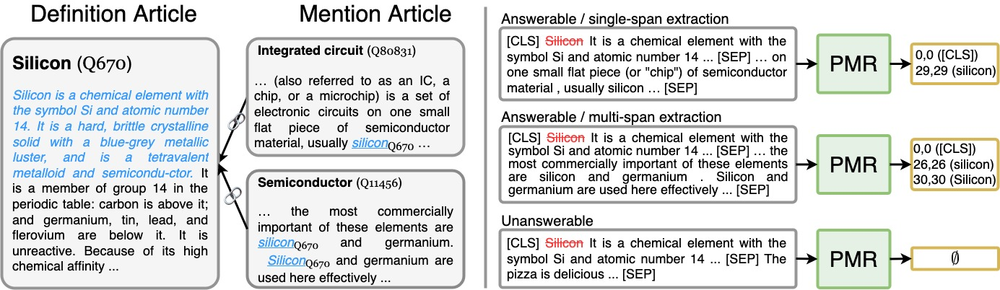
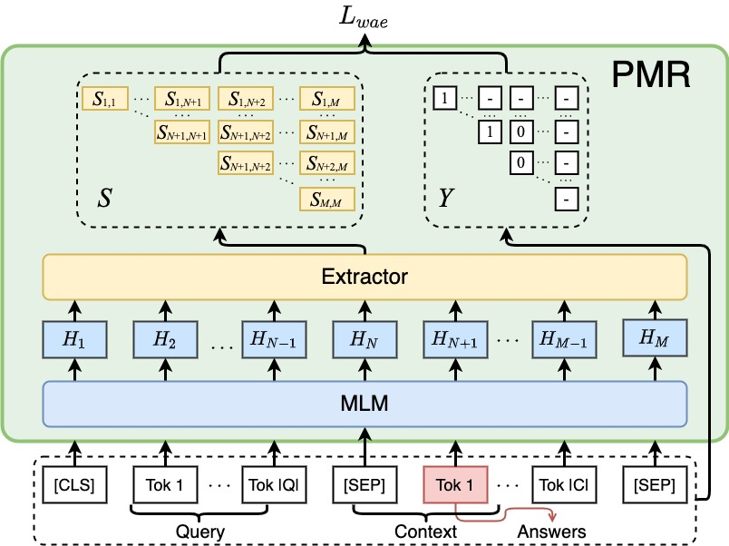

# Pre-training Machine Reader (Instead of Masked Language Model) at Scale
- This repo contains the code of the following papers working on large-scale machine reader pre-training, 
  -  [From Cloze to Comprehension: Retrofitting Pre-trained Language Models to Pre-trained Machine Readers](https://arxiv.org/pdf/2212.04755.pdf), NeurIPS 2023.
  -  [mPMR: A Multilingual Pre-trained Machine Reader at Scale](https://aclanthology.org/2023.acl-short.131.pdf), ACL 2023.

## Introduction
Pre-trained Machine Reader (PMR) is pre-trained with 18 million Machine Reading Comprehension (MRC) examples constructed with Wikipedia Hyperlinks using a learning objective called Wiki Anchor Extraction (WAE).
Specifically, we constructed a large volume of general-purpose and high-quality MRC-style training data based on Wikipedia anchors (i.e., hyperlinked texts).
For each Wikipedia anchor, we composed a pair of correlated articles.
One side of the pair is the Wikipedia article that contains detailed descriptions of the hyperlinked entity, which we defined as the definition article.
The other side of the pair is the article that mentions the specific anchor text, which we defined as the mention article.
We composed an MRC-style training instance in which the anchor is the answer, 
the surrounding passage of the anchor in the mention article is the context, and the definition of the anchor entity in the definition article is the query.
<p align="center" width="100%">
<a target="_blank"></a>
</p>
Based on the above data, we then introduced a novel WAE problem as the pre-training task of PMR.
In this task, PMR determines whether the context and the query are relevant.
If so, PMR extracts the answer from the context that satisfies the query description.
<p align="center" width="100%">
<a target="_blank"></a>
</p>

## Requirements
* python 3.6.12
* pytorch 1.9.0+cu111 (downloaded from the official webpage)
* transformers 4.17.0
* tqdm 4.63.0
* sentencepiece==0.1.96
* Levenshtein

## Preprocessing Wikipedia (Optional)
1. PMR

   1. We downloaded the English Wikipedia dump (2022-01-01) from [Wikimedia](https://dumps.wikimedia.org/enwiki) and preprocessed it with [WikiExtractor](https://github.com/attardi/wikiextractor). 
   The following code is our command to extract plain text with hyperlinks from the Wiki dump, which will create a folder named ``en`` that stores all extracted pages.
      ```     
      python WikiExtractor.py enwiki-20220801-pages-articles.xml.bz2 -c -l --json -o en   
      ```
   2. Then we use the following code to do tokenization for all the wiki pages. The outputs are two file named ``en/processed/e2p.bz2`` and ``en/processed/e2c.bz2``.
      ``e2p`` is a dictionary that maps the entity (e) to its tokenized wiki page (p). ``e2c`` is another dictionary that maps the entity (e) to its anchor's context (c).
      We provide our processed files [here](https://huggingface.co/datasets/DAMO-NLP-SG/HyperlinkMRC).
      ```
      cp -r wikiextractor/en ./
      python preprocessing_PMR/wiki_preprocess_multiprocess.py --file en --processes 20
      ```
   4. Once we get the tokenized data, we do sampling to select a number of context for each wiki entity. We set an upper bound (``--up``) of context number and
      a filtering threshold (``--bottom``) to filter out the entities that have fewer contexts.
      ```     
      python preprocessing_PMR/wiki_sampling.py --method fre --fre 10 --k 10 --file en --sample_data full-random10
      ```
   5. We also generate the token id using the model tokenizer and save it in a cached file for fast reusage and accelerating the training process (``--evaluate`` for generating the cache file of test set).
      ```     
      python preprocessing_PMR/wikipedia2mrc_multiprocess.py --processes 20 --file en --sample_data full-random10 --model_type roberta --model_name_or_path roberta-base --do_negative --buffer 7000000 --simple
      python preprocessing_PMR/wikipedia2mrc_multiprocess.py --processes 20 --file en --sample_data full-random10 --model_type roberta --model_name_or_path roberta-base --do_negative --buffer 7000000 --simple --evaluate
      ```
2. mPMR

   1. We downloaded the English Wikipedia dump (2022-08-01) from [Wikimedia](https://dumps.wikimedia.org/enwiki) and preprocessed it with [WikiExtractor](https://github.com/attardi/wikiextractor). 
   The following code is our command to extract plain text with hyperlinks from the Wiki dump, which will create a folder named ``en`` that stores all extracted pages.
       ```     
       python WikiExtractor.py enwiki-20220801-pages-articles.xml.bz2 -c -l --json -o en   
       cp -r ./en ../mPMR/
       ```
 
   2. After extracting wikipedia pages for all languages (step 1 in the last section), we provide preprocessing scripts to create MRC examples for all languages. 
      ```
      bash preprocessing_mPMR/wiki_preprocess.sh
      bash preprocessing_mPMR/wiki_sampling.sh
      bash preprocessing_mPMR/wiki2mrc.sh
      ```

   3. Since each cache file contains the MRC examples of the same language, we do another mix procedure such that each cache file contains exmaples from all languages with the same distribution (``--evaluate`` for mixing the cache file of test set). 
      ```     
      python preprocessing_mPMR/wiki_mix_fast.py --langs ar_bn_de_fi_fr_el_en_es_hi_id_it_ja_ko_nl_pl_pt_ru_sv_sw_te_th_tr_vi_zh --sample_data full-random-10 --model_type xlmr --saved_buffer 7000000 --buffer 10000000 --do_negative --out_dir mix24
      python preprocessing_mPMR/wiki_mix_fast.py --langs ar_bn_de_fi_fr_el_en_es_hi_id_it_ja_ko_nl_pl_pt_ru_sv_sw_te_th_tr_vi_zh --sample_data full-random-10 --model_type xlmr --saved_buffer 7000000 --buffer 10000000 --do_negative --out_dir mix24 --evaluate
      ```


## Pre-training (Optinal)
Once we get the cached file, we can start pre-training. Please refer to the following codes for pre-training PMR/mPMR models.
```
bash train.sh           ## Notes: PMR on top of RoBERTa-base
bash train-large.sh     ## Notes: PMR on top of RoBERTa-large
bash train-xxlarge.sh   ## Notes: PMR on top of ALBERT-xxlarge
bash mtrain.sh          ## Notes: mPMR on top of XLMR-base
bash mtrain-large.sh    ## Notes: mPMR on top of XLMR-large
```

## Pre-trained Models
| Model                                                         | HF_Name                 |
|---------------------------------------------------------------|-------------------------|
| [PMR-base](https://huggingface.co/DAMO-NLP-SG/PMR-base)       | DAMO-NLP-SG/PMR-base    |  
| [PMR-xxlarge](https://huggingface.co/DAMO-NLP-SG/PMR-xxlarge) | DAMO-NLP-SG/PMR-large   |
| [PMR-large](https://huggingface.co/DAMO-NLP-SG/PMR-large)     | DAMO-NLP-SG/PMR-xxlarge |
| [mPMR-base](https://huggingface.co/DAMO-NLP-SG/mPMR-base)     | DAMO-NLP-SG/mPMR-base   |
| [mPMR-large](https://huggingface.co/DAMO-NLP-SG/mPMR-large)   | DAMO-NLP-SG/mPMR-large  |


## Fine-tuning 
* The downstream datasets are provided in ```$task/Data/$dataset```.
* Using the provided scripts to fine-tune a task-specific model. (Following is an exmaple of fine-tuning CONLL03)
  ```
  cd NER
  bash conll03.sh
  ```

## Example Usage of Fine-tuned PMR
TODO


## Citation
If the code is used in your research, please star our repo and cite our paper as follows:
```
@article{xu2022clozing,
  title={From Clozing to Comprehending: Retrofitting Pre-trained Language Model to Pre-trained Machine Reader},
  author={Xu, Weiwen and Li, Xin and Zhang, Wenxuan and Zhou, Meng and Bing, Lidong and Lam, Wai and Si, Luo},
  journal={arXiv preprint arXiv:2212.04755},
  year={2022}
}

@inproceedings{xu2022mpmr,
    title = "mPMR: A Multilingual Pre-trained Machine Reader at Scale",
    author = "Xu, Weiwen  and
      Li, Xin  and
      Lam, Wai  and
     Bing, Lidong",
    booktitle = "The 61th Annual Meeting of the Association for Computational Linguistics.",
    year = "2023",
}
```
     
